Protein Network from GWAS Hits
================

## Goal

To use STRING.DB to visualize the network of proteins that is related to
hypertension and blood pressure (HTN related traits).

## Source data

Data original source: <https://www.ncbi.nlm.nih.gov/gap/phegeni>. The
Phenotype-Genotype Integrator (PheGenI), merges NHGRI genome-wide
association study (GWAS) catalog data with several databases housed at
the National Center for Biotechnology Information (NCBI), including
Gene, dbGaP, OMIM, eQTL and dbSNP. More comprehensive lists can be
obtained from other sources. For this Codeathon events, we only use this
list as a toy example.

Obtain the data from NCBI website

``` bash
#wget "https://www.ncbi.nlm.nih.gov/projects/gap/eqtl/EpiViewBE.cgi?type=dl.tab"
```

## Processing the table of GWAS results

In this session, we conducted prelimiary descriptive analysis of the
results table. Then we extracted the records related to hypertension and
blood pressure (HTN related traits).

### Descriptive analysis of GWAS results

For visualization, it is easier to display the significant level of
p-value than its original scale.

``` r
dd= read.csv("/data/liq4/CCDGS_y2024/codeathon/publicdata/PheGenI_Association_full.tab", sep="\t", header=T, as.is=T)
str(dd)
```

    ## 'data.frame':    136526 obs. of  16 variables:
    ##  $ X.         : int  1 2 3 4 5 6 7 8 9 10 ...
    ##  $ Trait      : chr  "1-Alkyl-2-acetylglycerophosphocholine Esterase" "1-Alkyl-2-acetylglycerophosphocholine Esterase" "1-Alkyl-2-acetylglycerophosphocholine Esterase" "1-Alkyl-2-acetylglycerophosphocholine Esterase" ...
    ##  $ SNP.rs     : int  10782529 7528419 12740374 599839 600550 964184 12286037 10846744 11057841 10144042 ...
    ##  $ Context    : chr  "intergenic" "UTR-3" "UTR-3" "nearGene-3" ...
    ##  $ Gene       : chr  "SSX2IP" "CELSR2" "CELSR2" "PSRC1" ...
    ##  $ Gene.ID    : int  117178 1952 1952 84722 643680 8882 8882 949 949 388011 ...
    ##  $ Gene.2     : chr  "LPAR3" "CELSR2" "CELSR2" "PSRC1" ...
    ##  $ Gene.ID.2  : int  23566 1952 1952 84722 643680 8882 8882 949 949 283598 ...
    ##  $ Chromosome : int  1 1 1 1 11 11 11 12 12 14 ...
    ##  $ Location   : int  84802559 109274569 109274967 109279543 60230192 116778200 116781490 124827878 124832196 98033120 ...
    ##  $ P.Value    : num  4e-06 1e-17 2e-22 3e-15 2e-11 ...
    ##  $ Source     : chr  "NHGRI" "NHGRI" "NHGRI" "NHGRI" ...
    ##  $ PubMed     : int  23118302 22003152 23118302 20442857 23118302 22003152 20442857 20442857 23118302 23118302 ...
    ##  $ Analysis.ID: int  0 0 0 0 0 0 0 0 0 0 ...
    ##  $ Study.ID   : int  NA NA NA NA NA NA NA NA NA NA ...
    ##  $ Study.Name : chr  "" "" "" "" ...

``` r
## let us modify the pvalue to show -log10() scale
## need to take care of P.Value=0
lowest.P = min (dd$P.Value[dd$P.Value!=0])
dd$P.Value[dd$P.Value==0] = lowest.P
dd$p.sig= -log10(dd$P.Value)
```

Remove outliers from the table. Some traits that comes from one study
with many GWAS hits for one trait. For example, to note that “Platelet
Function Tests” return 16346 signification SNPs (11% of the GWAS hits).
We would consider them as outliers.

    ## 
    ## Attaching package: 'dplyr'

    ## The following objects are masked from 'package:stats':
    ## 
    ##     filter, lag

    ## The following objects are masked from 'package:base':
    ## 
    ##     intersect, setdiff, setequal, union

    ## ── Attaching core tidyverse packages ──────────────────────── tidyverse 2.0.0 ──
    ## ✔ forcats   1.0.0     ✔ readr     2.1.5
    ## ✔ ggplot2   3.5.0     ✔ stringr   1.5.1
    ## ✔ lubridate 1.9.3     ✔ tibble    3.2.1
    ## ✔ purrr     1.0.2     ✔ tidyr     1.3.1
    ## ── Conflicts ────────────────────────────────────────── tidyverse_conflicts() ──
    ## ✖ dplyr::filter() masks stats::filter()
    ## ✖ dplyr::lag()    masks stats::lag()
    ## ℹ Use the conflicted package (<http://conflicted.r-lib.org/>) to force all conflicts to become errors

``` r
dd$studyTrait=paste(dd$Study.ID, dd$Trait, sep="_")
tb.summary = dd %>% group_by (studyTrait) %>% summarise(Freq=n()) %>% arrange(desc(Freq))
tb.summary
```

    ## # A tibble: 1,525 × 2
    ##    studyTrait                                  Freq
    ##    <chr>                                      <int>
    ##  1 375_Platelet Function Tests                15653
    ##  2 267_Child Development Disorders, Pervasive  5121
    ##  3 NA_Bronchodilator Agents                    3459
    ##  4 NA_Lung Volume Measurements                 2296
    ##  5 NA_Body Mass Index                          1992
    ##  6 NA_Forced Expiratory Volume                 1554
    ##  7 NA_Schizophrenia                            1350
    ##  8 342_Echocardiography                        1183
    ##  9 221_Body Height                             1153
    ## 10 342_Cholesterol, HDL                        1146
    ## # ℹ 1,515 more rows

``` r
dd=dd[!is.element(dd$studyTrait, 
                  c("375_Platelet Function Tests", "267_Child Development Disorders, Pervasive")), ]
dim(dd)
```

    ## [1] 115752     18

``` r
tb.summary = dd %>% group_by (studyTrait) %>% summarise(Freq=n()) %>% arrange(desc(Freq))
tb.summary
```

    ## # A tibble: 1,523 × 2
    ##    studyTrait                   Freq
    ##    <chr>                       <int>
    ##  1 NA_Bronchodilator Agents     3459
    ##  2 NA_Lung Volume Measurements  2296
    ##  3 NA_Body Mass Index           1992
    ##  4 NA_Forced Expiratory Volume  1554
    ##  5 NA_Schizophrenia             1350
    ##  6 342_Echocardiography         1183
    ##  7 221_Body Height              1153
    ##  8 342_Cholesterol, HDL         1146
    ##  9 342_Blood Pressure           1060
    ## 10 221_Blood Pressure            971
    ## # ℹ 1,513 more rows

Histogram of distribution of counts for SNP, studied traits and nearby
genes for significant SNPs. We can see for a majority of the reported
GWAS hits, most of the significant SNP are only reported for one trait.

``` r
## show the enrichment of trait, SNP and genes
tb.trait=sort(table(dd$Trait), decreasing = T)
tb.SNP = sort(table(dd$SNP.rs), decreasing = T)
tb.gene=sort(table(dd$Gene), decreasing = T)

tb.psig=sort(table(dd$p.sig), decreasing = T)

hist(tb.SNP, main="Histogram of counts of SNPs") #(1-200, mode=1, there are some 2s)
```

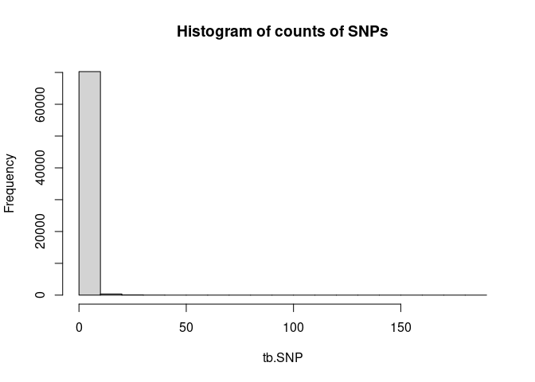<!-- -->

``` r
hist(tb.trait, main="Histogram of counts of traits") #(1-150000, model=1,2)
```

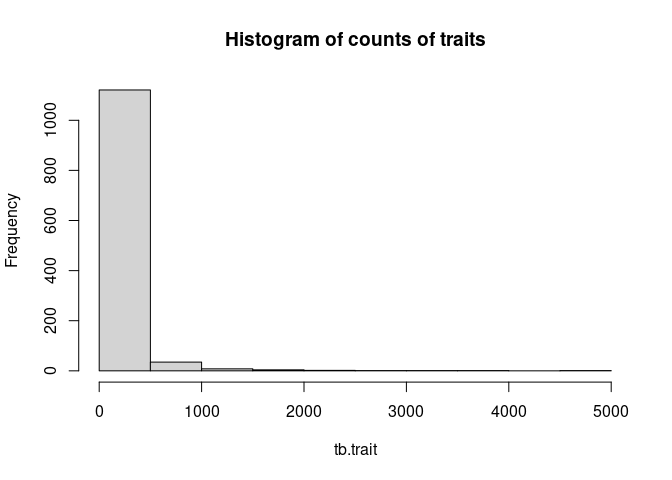<!-- -->

``` r
hist(tb.gene, main="Histogram of counts of genes annotated for the SNPs")
```

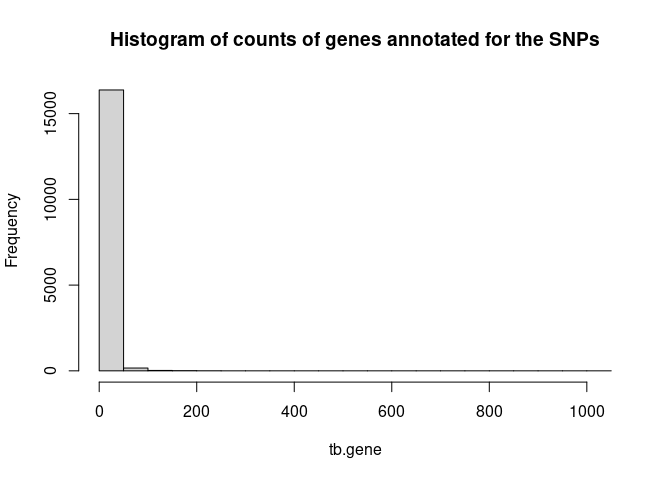<!-- -->

Now let us see the distributions of the p-value significant levels for
all GAWS hits

``` r
hist(tb.psig, main=c("Histogram of p-value significant levels", "among all GWAS hits"), xlab="-log10(p-value); the higher value, the more significant")
```

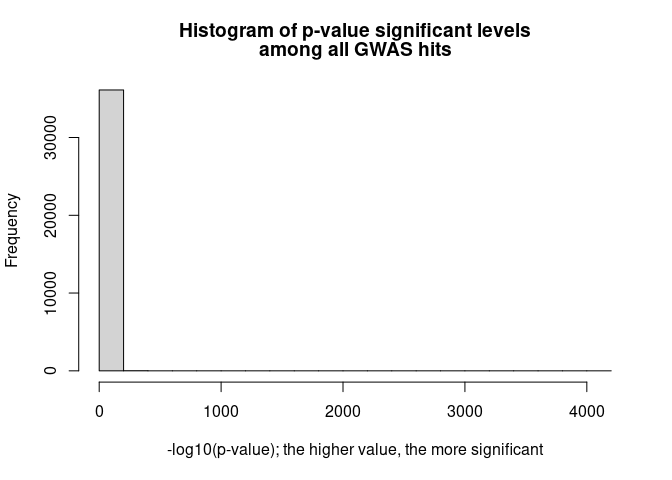<!-- -->

``` r
hist(tb.psig[tb.psig<=10], xlim=c(0, 14), main=c("Histogram of p-value significant levels among all GWAS hits", "excluding extreme low p.value < 10^(-40)"), xlab="-log10(p-value); the higher value, the more significant")
```

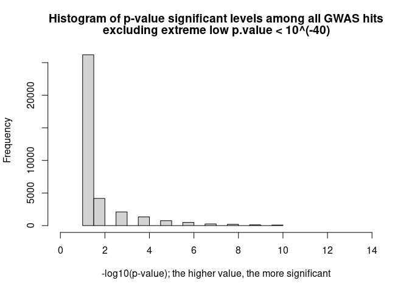<!-- -->

### Extract lists of genes for HTN related traits

We would like to extract all the GWAS hits for trait “hypertension” and
“blood pressure”. For each SNP, the table show the gene annotation. We
will use the first two annotated gene as the gene associated with
hypertension. If the same gene is associated with other traits, we would
also tally the occurrence for those gene implicated for other traits.

``` r
pTrait.filter = (dd$Trait=="Hypertension" | dd$Trait=="Blood Pressure")
dd.trait1=dd[pTrait.filter, ]
dim(dd.trait1)
```

    ## [1] 4976   18

``` r
trait.gene = unique(c(dd.trait1$Gene, dd.trait1$Gene.2))
length(trait.gene)
```

    ## [1] 2907

We have 4976 gene implicated for 2907 significant SNPs for HTN related
traits. We would like to see the chromosomes distribution of those
significant SNPs as well as if those genes are implicated for other
significant associations with other traits.

``` r
table(dd.trait1$Chromosome)
```

    ## 
    ##   1   2   3   4   5   6   7   8   9  10  11  12  13  14  15  16  17  18  19  20 
    ## 380 355 331 317 379 302 263 247 199 400 240 285 127 145 271 122 128 101  92 139 
    ##  21  22  23 
    ##  50  44  59

``` r
dd.otherTrait = dd[!pTrait.filter, ]
dim(dd.otherTrait)
```

    ## [1] 110776     18

``` r
dd.oth1 = dd.otherTrait[is.element(dd.otherTrait$Gene.1, trait.gene), ]
dd.oth2 = dd.otherTrait[is.element(dd.otherTrait$Gene.2, trait.gene), ]
dd.oth = rbind(dd.oth1, dd.oth2)
hist(log10(table(dd.oth$Trait)))  ## on log10 scale for occurance of other traits
```

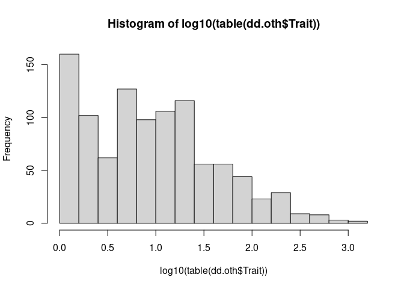<!-- -->

What are the other traits that share the same significant gene
association signals as HTN related traits? List the top 20:

``` r
ct.trait = table(dd.oth$Trait)
tmp = sort(ct.trait, decreasing = T)[1:20]
top.relatedT = cbind(ct =unlist(tmp))
top.relatedT
```

    ##                                          ct
    ## Body Mass Index                        1135
    ## Bronchodilator Agents                  1134
    ## Cholesterol, HDL                        904
    ## Body Height                             748
    ## Lung Volume Measurements                735
    ## Forced Expiratory Volume                580
    ## Triglycerides                           574
    ## Respiratory Function Tests              567
    ## Cholesterol, LDL                        559
    ## Cholesterol                             473
    ## Schizophrenia                           456
    ## Echocardiography                        452
    ## Body Weight                             408
    ## Electrocardiography                     354
    ## Hip                                     354
    ## Stroke                                  354
    ## Arterial Pressure                       323
    ## Myocardial Infarction                   320
    ## Autistic Disorder                       312
    ## Pulmonary Disease, Chronic Obstructive  274

### Identify other traits that share the same associated genes

Given the list of 4976 genes indicated by HTN related traits, we tally
how many the genes also appear for other traits. Take the top three
other traits that share the most number of associated genes with HTN
related traits.

``` r
oth.totalSNP = dd.oth %>% group_by(Trait) %>% summarise(Freq=n()) ## total SNPs by trait
oth.sameGene = dd.oth %>% group_by(Trait) %>% mutate(sameG = is.element(Gene, trait.gene))%>% summarise(sameGCt = sum(sameG)) %>% arrange(desc(sameGCt))
oth.sameGene = oth.sameGene %>% merge(oth.totalSNP) %>% mutate(prop=sameGCt/Freq) %>% arrange(desc(sameGCt))
hist(oth.sameGene$prop)
```

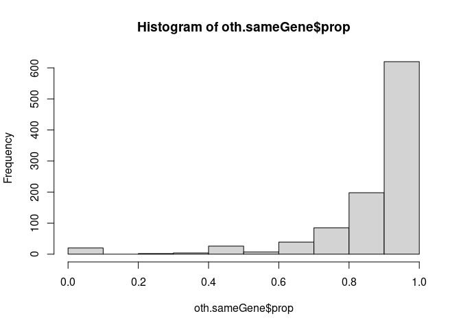<!-- -->

``` r
hist(oth.sameGene$sameGCt)
```

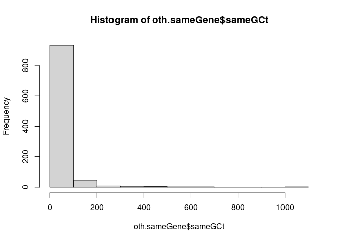<!-- -->

``` r
#oth.sameGene
```

We would like to keep those traits with large number of shared genes
with HTN related traits, at the same time, the proption of those shared
genes is also high among trait specic hits. In anothe words, the large
number of shared genes are not driven by its own large number of GWAS
hits.

``` r
plot(oth.sameGene$Freq, oth.sameGene$sameGCt, xlim=c(0, 1400), ylim=c(0, 1400), xlab="Total SNPs reported", ylab="Shared gene counts with HTN", main=c("By Traits: Number of GWAS hits", "vs. Number of Shared Genes"))
abline(a=0, b=1,lty="dotted", col="blue")
```

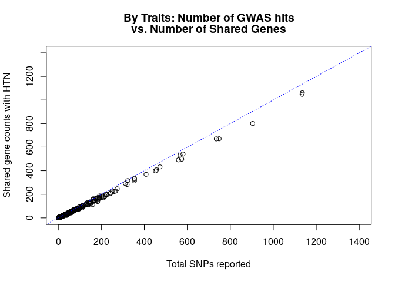<!-- -->

Only keep the traits with total SNPs reported \> 800. We considered
“Body Mass Index”, “Bronchodilator Agents”, and “Cholesterol, HDL” most
related to HTN related traits due to enrichment of shared genes among
them.

``` r
trait.related = oth.sameGene %>% filter(Freq>800)
trait.related
```

    ##                   Trait sameGCt Freq      prop
    ## 1       Body Mass Index    1061 1135 0.9348018
    ## 2 Bronchodilator Agents    1048 1134 0.9241623
    ## 3      Cholesterol, HDL     801  904 0.8860619

``` r
dd.othKept = dd.oth %>% filter( is.element(Trait, trait.related$Trait))
dim(dd.othKept)
```

    ## [1] 3173   18

``` r
dd.trait2 = rbind(dd.othKept, dd.trait1)
da.ven = dd.trait2 %>% select(Trait, Gene) %>% group_by(Trait) %>% summarise_all(~list(unique(Gene)))
str(da.ven)
```

    ## tibble [5 × 2] (S3: tbl_df/tbl/data.frame)
    ##  $ Trait: chr [1:5] "Blood Pressure" "Body Mass Index" "Bronchodilator Agents" "Cholesterol, HDL" ...
    ##  $ Gene :List of 5
    ##   ..$ : chr [1:2055] "TAS1R3" "MORN1" "LOC100129534" "PANK4" ...
    ##   ..$ : chr [1:423] "LINC01134" "KAZN" "LINC01141" "PTPRU" ...
    ##   ..$ : chr [1:218] "PRDM16" "CAMTA1" "TXNP2" "VAV3-AS1" ...
    ##   ..$ : chr [1:347] "RPL7AP18" "KAZN" "PTPRU" "PDE4B" ...
    ##   ..$ : chr [1:219] "PRDM16" "CASZ1" "MTHFR" "KDM4A" ...

``` r
da.ven.plot.input = da.ven$Gene
names(da.ven.plot.input)=da.ven$Trait
str(da.ven.plot.input)
```

    ## List of 5
    ##  $ Blood Pressure       : chr [1:2055] "TAS1R3" "MORN1" "LOC100129534" "PANK4" ...
    ##  $ Body Mass Index      : chr [1:423] "LINC01134" "KAZN" "LINC01141" "PTPRU" ...
    ##  $ Bronchodilator Agents: chr [1:218] "PRDM16" "CAMTA1" "TXNP2" "VAV3-AS1" ...
    ##  $ Cholesterol, HDL     : chr [1:347] "RPL7AP18" "KAZN" "PTPRU" "PDE4B" ...
    ##  $ Hypertension         : chr [1:219] "PRDM16" "CASZ1" "MTHFR" "KDM4A" ...

``` r
## double checking code
da.ven2 = dd.trait2 %>% select(Trait, Gene)
tmp = tapply(da.ven2, list(da.ven2$Trait), unique)
str(tmp)
```

    ## List of 5
    ##  $ Blood Pressure       :'data.frame':   2055 obs. of  2 variables:
    ##   ..$ Trait: chr [1:2055] "Blood Pressure" "Blood Pressure" "Blood Pressure" "Blood Pressure" ...
    ##   ..$ Gene : chr [1:2055] "TAS1R3" "MORN1" "LOC100129534" "PANK4" ...
    ##  $ Body Mass Index      :'data.frame':   423 obs. of  2 variables:
    ##   ..$ Trait: chr [1:423] "Body Mass Index" "Body Mass Index" "Body Mass Index" "Body Mass Index" ...
    ##   ..$ Gene : chr [1:423] "LINC01134" "KAZN" "LINC01141" "PTPRU" ...
    ##  $ Bronchodilator Agents:'data.frame':   218 obs. of  2 variables:
    ##   ..$ Trait: chr [1:218] "Bronchodilator Agents" "Bronchodilator Agents" "Bronchodilator Agents" "Bronchodilator Agents" ...
    ##   ..$ Gene : chr [1:218] "PRDM16" "CAMTA1" "TXNP2" "VAV3-AS1" ...
    ##  $ Cholesterol, HDL     :'data.frame':   347 obs. of  2 variables:
    ##   ..$ Trait: chr [1:347] "Cholesterol, HDL" "Cholesterol, HDL" "Cholesterol, HDL" "Cholesterol, HDL" ...
    ##   ..$ Gene : chr [1:347] "RPL7AP18" "KAZN" "PTPRU" "PDE4B" ...
    ##  $ Hypertension         :'data.frame':   219 obs. of  2 variables:
    ##   ..$ Trait: chr [1:219] "Hypertension" "Hypertension" "Hypertension" "Hypertension" ...
    ##   ..$ Gene : chr [1:219] "PRDM16" "CASZ1" "MTHFR" "KDM4A" ...
    ##  - attr(*, "dim")= int 5
    ##  - attr(*, "dimnames")=List of 1
    ##   ..$ : chr [1:5] "Blood Pressure" "Body Mass Index" "Bronchodilator Agents" "Cholesterol, HDL" ...

## Venn diagrams showing shared genes

``` r
library("ggVennDiagram")
```

    ## 
    ## Attaching package: 'ggVennDiagram'

    ## The following object is masked from 'package:tidyr':
    ## 
    ##     unite

``` r
ggVennDiagram(da.ven.plot.input, label_alpha = 0, label="count")+ 
  scale_fill_gradient(low = "#F4FAFE", high = "#4981BF")+scale_x_continuous(expand = expansion(mult = .2))
```

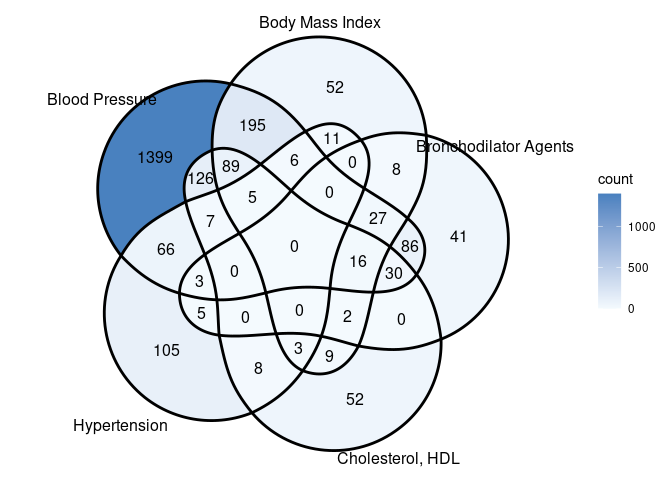<!-- -->

``` r
ggVennDiagram(da.ven.plot.input[c(1,5)], label_alpha = 0)+scale_fill_distiller(palette = "RdBu")+scale_x_continuous(expand = expansion(mult = .2))
```

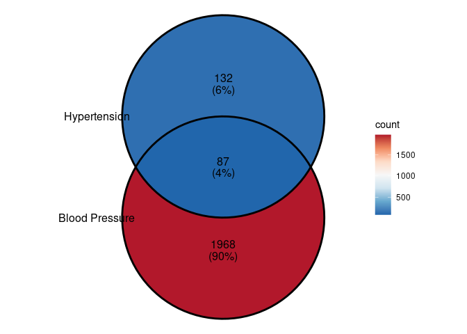<!-- -->

``` r
ggVennDiagram(da.ven.plot.input[c(1,4,5)], label_alpha = 0)+scale_fill_distiller(palette = "RdBu")+scale_x_continuous(expand = expansion(mult = .2))
```

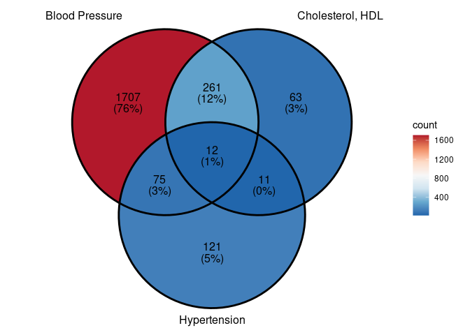<!-- -->

``` r
ggVennDiagram(da.ven.plot.input[c(1,2,5)], label_alpha = 0)+scale_fill_distiller(palette = "RdBu")+scale_x_continuous(expand = expansion(mult = .2))
```

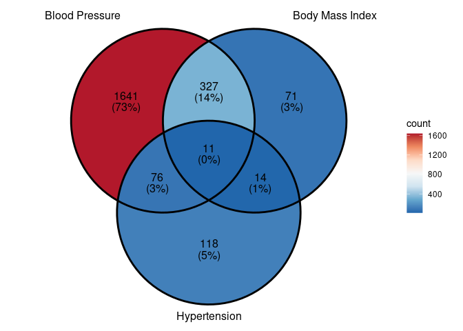<!-- -->

``` r
ggVennDiagram(da.ven.plot.input[c(1,3,5)], label_alpha = 0)+scale_fill_distiller(palette = "RdBu")+scale_x_continuous(expand = expansion(mult = .2))
```

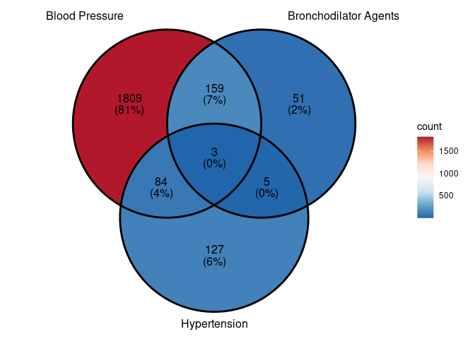<!-- -->

``` r
ggVennDiagram(da.ven.plot.input[c(2,3,4)], label_alpha = 0)+scale_fill_distiller(palette = "RdBu")+scale_x_continuous(expand = expansion(mult = .2))
```

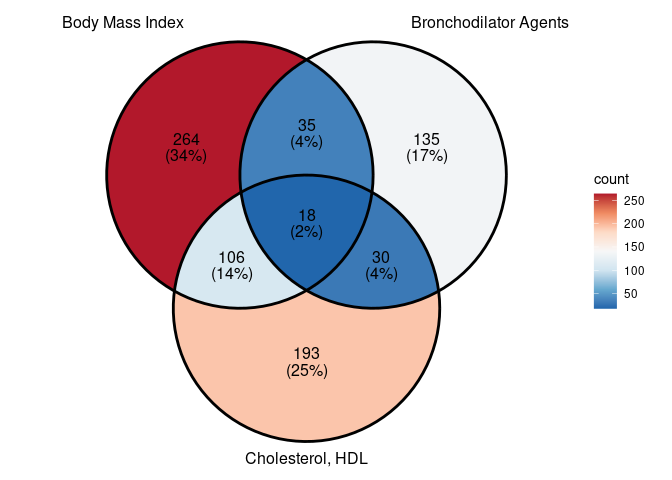<!-- -->

## Gene network overlaid by protein network

We extracted the genes shared among hypertension, blood pressure and
cholesterol (HDL), and construct the network showing the strength of
association signals. We also query the protein network predicted by
STRING.db using the whole list of genes associated with the three
traits.

``` r
dd.network = dd.trait2 %>% filter(is.element(Trait, da.ven$Trait[c(1,4,5)])) %>% select(Trait, Gene, Chromosome, p.sig, Context)
dim(dd.network)
```

    ## [1] 5880    5

``` r
write.table(dd.network, file="network_HTN_3T_GWAS_gene.csv", sep=",", quote=T, col.names = T, row.names = F)                                  
```
