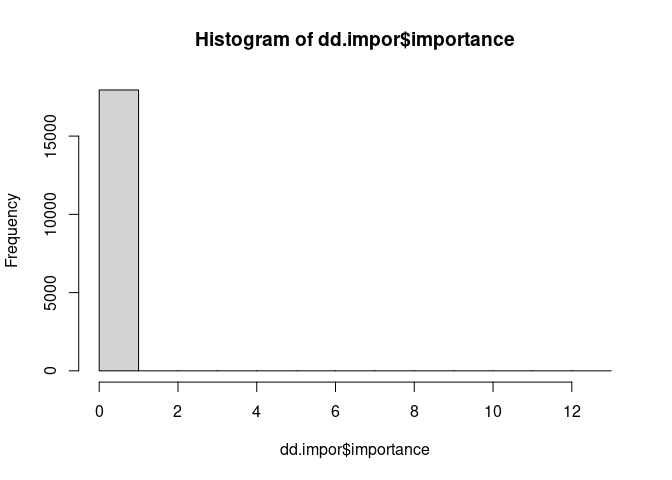
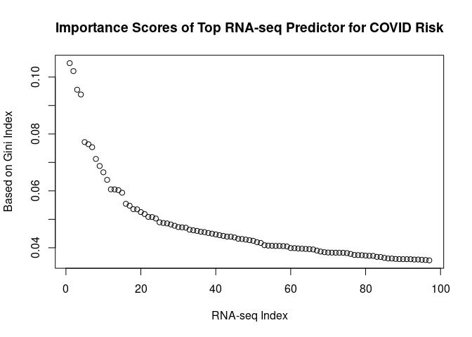
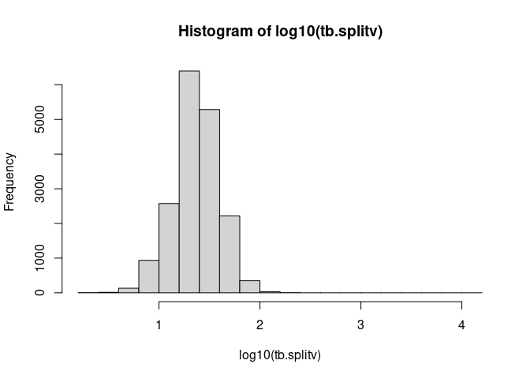

Explore Top Predictors for COVID from Random Forest Model
================

## Goal

Downstream processing of results from the Random Forest (RF) method. In
this document, we explore the prediction model to identify the top
predictors as well as possible interactions.

## Top predictors for COVID

``` r
dd.impor=read.csv("/data/liq4/CCDGS_y2024/codeathon/rf_results/ph_covid_wCov/first_covRF_rf_impor.csv", header=T, as.is=T)
str(dd.impor)
```

    ## 'data.frame':    17952 obs. of  5 variables:
    ##  $ ranSeed   : int  1012300 1012300 1012300 1012300 1012300 1012300 1012300 1012300 1012300 1012300 ...
    ##  $ treeP     : int  17000 17000 17000 17000 17000 17000 17000 17000 17000 17000 ...
    ##  $ mtry      : int  150 150 150 150 150 150 150 150 150 150 ...
    ##  $ splitVar  : chr  "Sex" "Age" "BMI" "T2D" ...
    ##  $ importance: num  0.016 12.8327 0.9646 0.1568 0.0362 ...

``` r
hist(dd.impor$importance)
```

<!-- -->

``` r
topPred = dd.impor %>% select(splitVar, importance) %>% arrange(desc(importance)) %>% head()
topPred
```

    ##   splitVar  importance
    ## 1      Age 12.83270336
    ## 2      BMI  0.96461969
    ## 3      T2D  0.15679055
    ## 4  v_11322  0.10488629
    ## 5  v_17202  0.10208962
    ## 6  v_17675  0.09555708

``` r
rna_pred = dd.impor %>% select(splitVar, importance) %>% arrange(desc(importance))%>% head(n=100)
rna_pred = rna_pred[-c(1:3), ]
plot(1:nrow(rna_pred), rna_pred$importance, xlab="RNA-seq Index", ylab="Based on Gini Index", main="Importance Scores of Top RNA-seq Predictor for COVID Risk")
```

<!-- -->

## How often a variable is picked in a forest

``` r
dd.split=read.csv("/data/liq4/CCDGS_y2024/codeathon/rf_results/ph_covid_wCov/first_covRF_rf_split.csv", header=T, as.is=T)
str(dd.split)
```

    ## 'data.frame':    494776 obs. of  6 variables:
    ##  $ ranSeed : int  1012301 1012301 1012301 1012301 1012301 1012301 1012301 1012301 1012301 1012301 ...
    ##  $ treeP   : int  17000 17000 17000 17000 17000 17000 17000 17000 17000 17000 ...
    ##  $ mtry    : int  150 150 150 150 150 150 150 150 150 150 ...
    ##  $ treeId  : int  1 1 1 1 1 1 1 1 1 1 ...
    ##  $ splitVar: chr  "Age" "v_1370" "v_17421" "v_2207" ...
    ##  $ splitVal: num  58.5 46.5494 0.0415 48.4856 0.0277 ...

Find out the most picked variables

``` r
tb.splitv = sort(table(dd.split$splitVar), decreasing = T)
hist(log10(tb.splitv))
```

<!-- -->

### Ref:

For RF package ranger,
<https://cran.r-project.org/web/packages/ranger/index.html>
