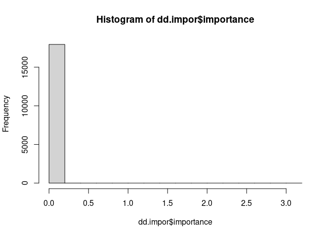
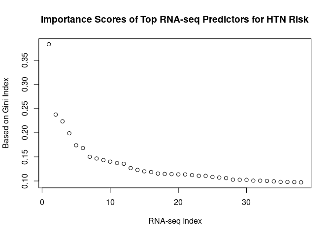
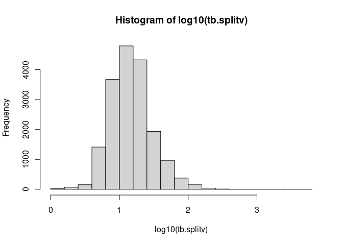

Explore Top Predictors for Hypertension from Random Forest Model
================

## Goal

Downstream processing of results from the Random Forest (RF) method. In
this document, we explore the prediction model to identify the top
predictors as well as possible interactions.

## Top predictors for Hypertension

``` r
dd.impor=read.csv("/data/liq4/CCDGS_y2024/codeathon/rf_results/ph_htn_wCov/htn_mtry200_covRF_rf_impor.csv", header=T, as.is=T)
str(dd.impor)
```

    ## 'data.frame':    17951 obs. of  5 variables:
    ##  $ ranSeed   : int  1012300 1012300 1012300 1012300 1012300 1012300 1012300 1012300 1012300 1012300 ...
    ##  $ treeP     : int  17000 17000 17000 17000 17000 17000 17000 17000 17000 17000 ...
    ##  $ mtry      : int  200 200 200 200 200 200 200 200 200 200 ...
    ##  $ splitVar  : chr  "Sex" "Age" "BMI" "T2D" ...
    ##  $ importance: num  0.00971 3.01666 0.53524 0.02323 0 ...

``` r
hist(dd.impor$importance)
```

<!-- -->

``` r
topPred = dd.impor %>% select(splitVar, importance) %>% arrange(desc(importance)) %>% head()
topPred
```

    ##   splitVar importance
    ## 1      Age  3.0166619
    ## 2      BMI  0.5352404
    ## 3  v_15359  0.3833601
    ## 4  v_13400  0.2376140
    ## 5  v_11583  0.2235366
    ## 6  v_10250  0.1988385

``` r
rna_pred = dd.impor %>% select(splitVar, importance) %>% arrange(desc(importance))%>% head(n=40)
rna_pred = rna_pred[-c(1,2), ]
plot(1:nrow(rna_pred), rna_pred$importance, xlab="RNA-seq Index", ylab="Based on Gini Index", main="Importance Scores of Top RNA-seq Predictors for HTN Risk")
```

<!-- -->

## How often a variable is picked in a forest

``` r
dd.split=read.csv("/data/liq4/CCDGS_y2024/codeathon/rf_results/ph_htn_wCov/htn_mtry200_covRF_rf_split.csv", header=T, as.is=T)
str(dd.split)
```

    ## 'data.frame':    358685 obs. of  6 variables:
    ##  $ ranSeed : int  1012301 1012301 1012301 1012301 1012301 1012301 1012301 1012301 1012301 1012301 ...
    ##  $ treeP   : int  17000 17000 17000 17000 17000 17000 17000 17000 17000 17000 ...
    ##  $ mtry    : int  200 200 200 200 200 200 200 200 200 200 ...
    ##  $ treeId  : int  1 1 1 1 1 1 1 1 1 1 ...
    ##  $ splitVar: chr  "v_13286" "v_11177" "v_3150" "BMI" ...
    ##  $ splitVal: num  0.669 16.535 0.277 25.245 20.975 ...

Find out the most picked variables

``` r
tb.splitv = sort(table(dd.split$splitVar), decreasing = T)
hist(log10(tb.splitv))
```

<!-- -->

### Ref:

For RF package ranger,
<https://cran.r-project.org/web/packages/ranger/index.html>
